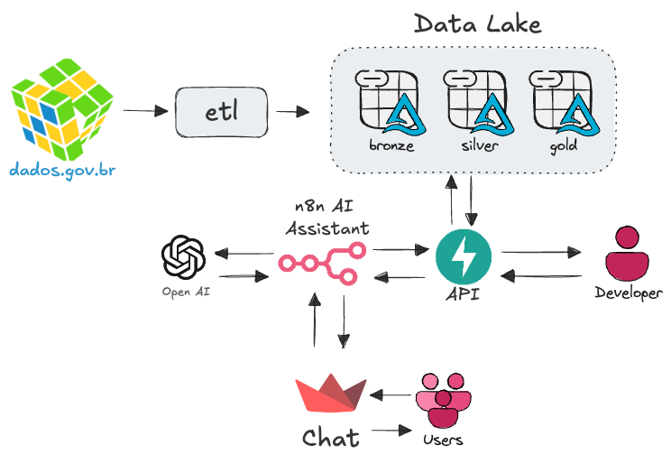

# N8N Observatorio - Assistente AI
Prova prática - Pesquisador Data Engineer [Observatório da Indústria - FIEC]



# Visão geral
- `n8n` → orquestração / dispara a API / AI Agent.
- `fastapi` → expõe endpoints para acionar o ETL (`/run-etl`) e consultar dados (`/datalake/...`).
- `elt` → container com PySpark que executa `pipelines.etl`.
- Volume compartilhado: `./datalake` no host é montado em `/datalake` dentro dos containers (onde ficam as tabelas Delta).

Portas expostas:
- n8n: `5678`
- FastAPI: `8000`
- Streamlit: `8501`

---
# Requisitos
- Docker (Engine)
- Docker Compose
- Git (opcional)
---

# Passo a passo para subir o ambiente

1. Clone o repositório (se ainda não estiver no avaliador):
```bash
git clone https://github.com/lucasfelicio/n8n-observatorio.git && cd n8n-observatorio
````

2. build da imagem base
```bash
docker compose build python-base
```

3. sobe todos os serviços
```bash
docker compose up -d --build
```

4. Verifique status
```bash
docker compose ps
```

# Acessos:
n8n UI: http://localhost:5678

FastAPI docs: http://localhost:8000/docs

Chat para interação: http://localhost:8501

# Endpoints relevantes (API)

* GET /health → checagem simples da API (retorna {"status":"ok"}).
* POST /run-etl → dispara o ETL. Retorna: returncode (0 = sucesso).
* GET /tables → lista tabelas disponíveis no GOLD_PATH.
* GET /query → executa query SQL (parâmetro `sql` na query string).
* GET /query/{table_name} → retorna as 10 primeiras linhas da tabela.

Rotas adicionais podem existir para consultar tabelas (ex.: /data/<tabela>).